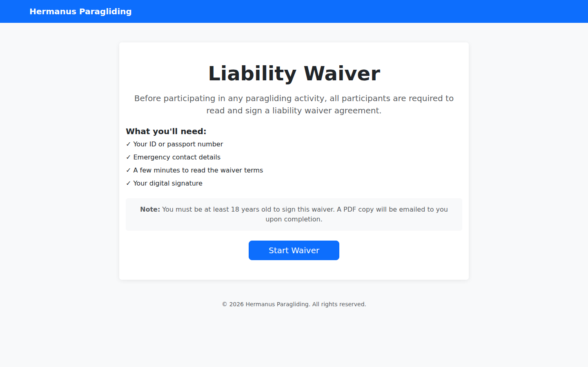
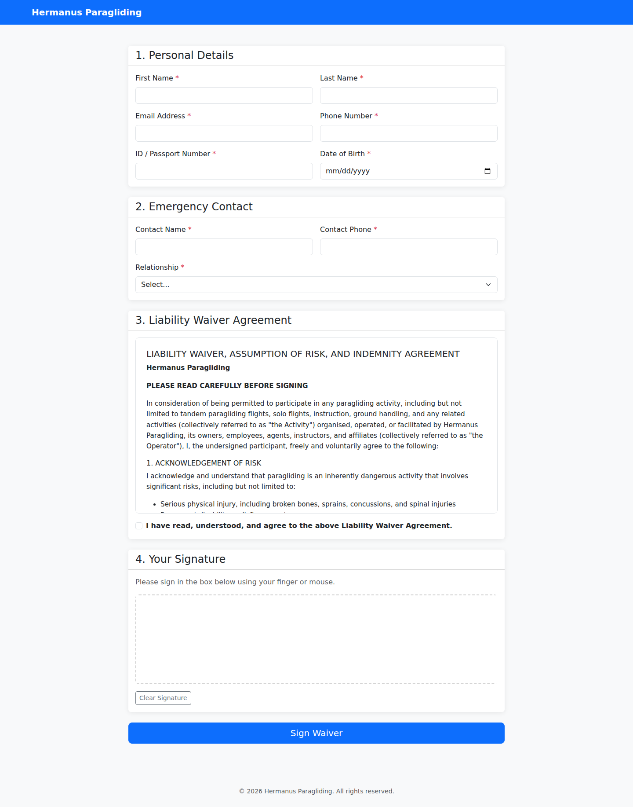
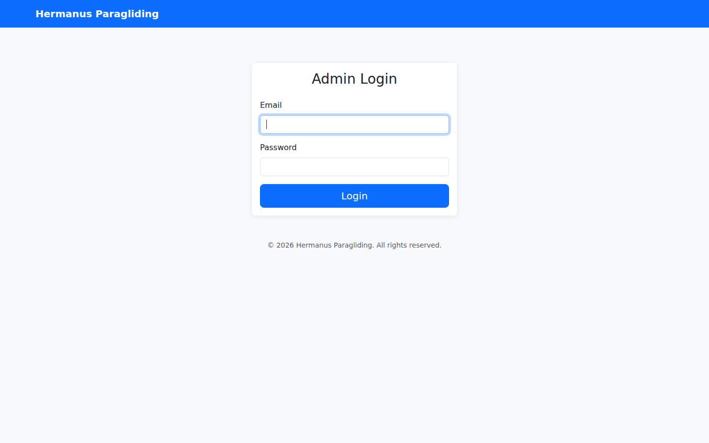
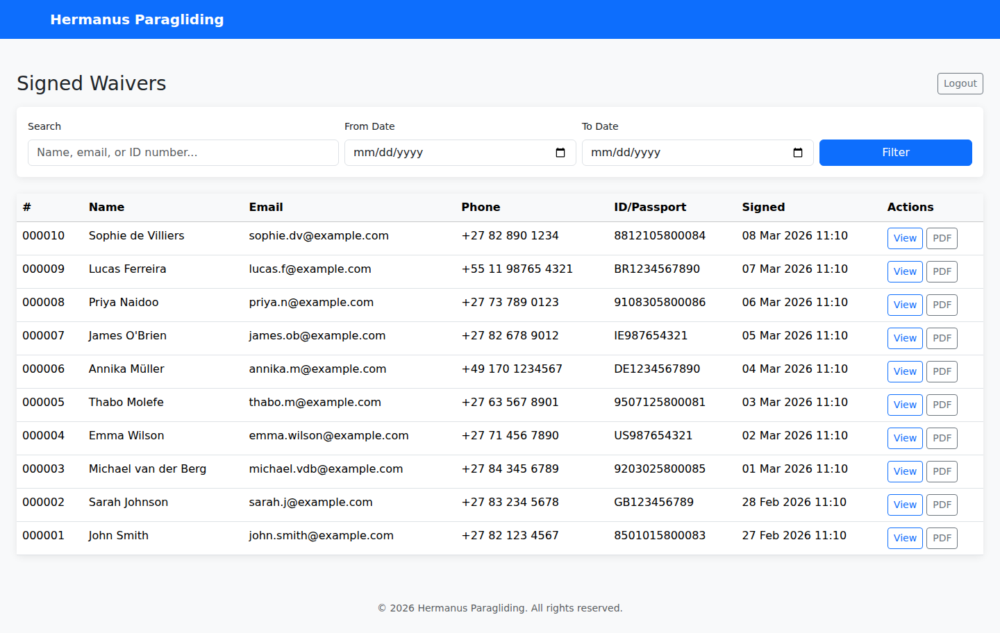
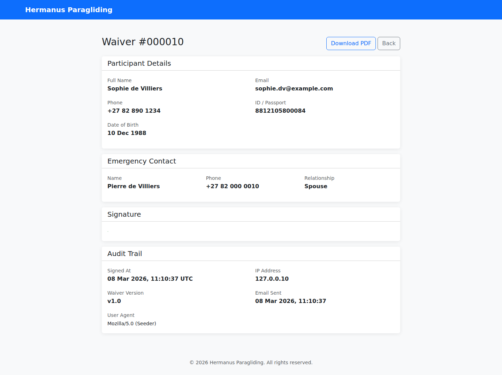
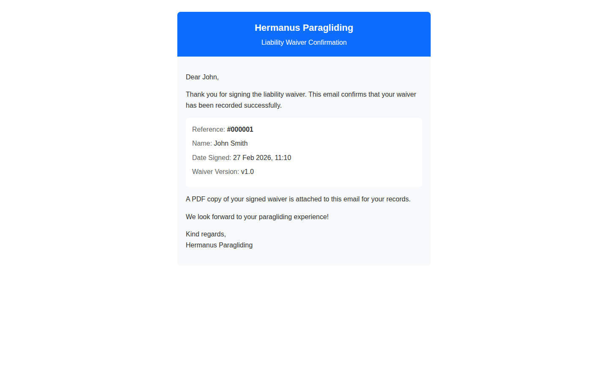

# Paraglider Waiver

A digital liability waiver application for Hermanus Paragliding. Participants sign waivers online, receive PDF confirmations via email, and administrators can manage all signed waivers through a dashboard.

Built with Laravel 12, Bootstrap 5, and DomPDF.

## Screenshots

### Landing Page


### Waiver Form


### Admin Login


### Admin Dashboard


### Waiver Detail


### Email Confirmation


## Requirements

- PHP 8.2+
- MySQL 8.4
- Node.js 20+
- Docker & Docker Compose (for Sail)

## Setup

```bash
# Clone and install
git clone <repo-url> && cd paraglider-waiver
cp .env.example .env

# Start Sail
./vendor/bin/sail up -d

# Install dependencies & setup
./vendor/bin/sail composer install
./vendor/bin/sail artisan key:generate
./vendor/bin/sail artisan migrate
./vendor/bin/sail artisan db:seed
npm install && npm run build
```

## Development

```bash
# Start dev environment
./vendor/bin/sail up -d

# Run tests
./vendor/bin/sail artisan test

# Static analysis (PHPStan level 6)
./vendor/bin/sail exec laravel.test ./vendor/bin/phpstan analyse

# Lint (Laravel Pint)
./vendor/bin/sail exec laravel.test ./vendor/bin/pint

# Seed sample data
./vendor/bin/sail artisan db:seed
```

## Architecture

The app follows a layered architecture with proper separation of concerns:

```
Request -> FormRequest -> Controller -> Service -> Repository -> Model
                                          |
                                       DTO (data transfer)
```

See [docs/DEV_STANDARDS.md](docs/DEV_STANDARDS.md) for full conventions and standards.

## Admin Access

Default credentials (configured via `.env`):

- **Email:** `admin@hermanus-paragliding.co.za`
- **Password:** `changeme123`
